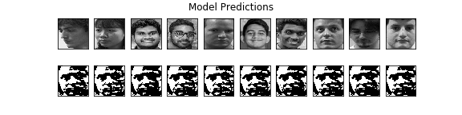
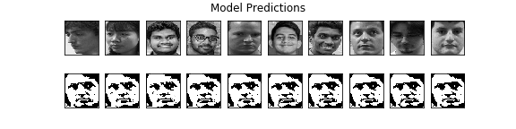
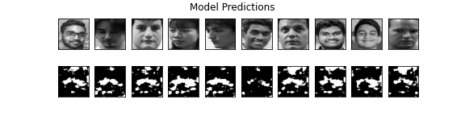

# [Model v1](models\1\README.md)

## Parameters

Optimizer - adam (LR - 0.001) <br>
Loss Function - mae <br>
Input Shape - (64, 64, 3) <br>
Filters - (128, 256) <br>
Latent Size - 256 <br>

## Notes

- Model overfitted because validation loss went up while validation went down
- Should have used a val_loss as the EarlyStopping patience must be lowered
- Need More data
- Try black and white images rather than RGB

## Predictions


# [Model v2](models\2\README.md)

## Parameters

Optimizer - adam (LR - 0.001) <br>
Loss Function - mse <br>
Input Shape - (128, 128, 1) <br>
Filters - (128, 128, 64) <br>
Latent Size - 256 <br>

## Notes

- Drop the accuracy metrics because as this is generative model accuracy don't give valid outputs
- Increased the size of the dataset by creating new faces by adding noise to existing faces
- Added some visualizations
- Changed model to use grayscale images
  - we really don't need colours to identify a faces
  - so we can just ignore RGB and make it easy on the model
  - that reduced the model size by half
- Increased input size so model get a more clear understanding of the face
- changed the filter sizes so there are more parameters to tune

## Predictions



# [Model v3](models\3\README.md)

## Parameters

Optimizer - adam (LR - 0.001) <br>
Loss Function - mse <br>
Input Shape - (128, 128, 1) <br>
Filters - (256, 128, 64) <br>
Latent Size - 350 <br>

## Notes

- Increased filter sizes so there are more parameters to tune
- Increased batch sizes so model can tune of large set of images at once

## Predictions



# [Model v4](models\4\README.md)

## Parameters

Optimizer - adam (LR - 0.001) <br>
Loss Function - mse <br>
Input Shape - (64, 64, 1) <br>
Filters - (128, 64, 32) <br>
Latent Size - 256 <br>

## Notes

- Downloaded new dataset
- Preprocessed all 621,126 Images (Which took 22 hours on 24 core Machine on GCP)
  - Extract Faces
  - Find the most front facing image
  - Separated features and targets
- Rewrote the data ingestion pipeline
  - as this dataset it huge we can't load the entire data set to the memory so I used tensorflow's ingestion pipeline to read that dataset in batches
  - all the loaded images need to be preprocessed again before sending it to the model. So I updated the pipeline to preprocessed in the CPU while GPU is training the model and GPU don't have wait for CPU to send data

|                                                                               |                                                                                   |
| :---------------------------------------------------------------------------: | :-------------------------------------------------------------------------------: |
|  |  |
|                                  **Before**                                   |                                     **After**                                     |

- Did some code refactoring
- Wrote a custom callback function to generate visualization of model's current progress

## Predictions



# [Model v5](models\5\README.md)

## Parameters

Optimizer - adam (LR - 0.001) <br>
Loss Function - mse <br>
Input Shape - (64, 64, 1) <br>
Filters - (128, 64, 32) <br>
Latent Size - 256 <br>

## Notes

- Trained the model on GCP with Nvidia k80
- Model couldn't convergence and loss got stuck around 0.35
  - Check Tensorboard logs for more info
  - Mostly likely gradient descent algorithm found a local minimum and LR rate was too small to get over it
  - Resetting the graph fixed the issue

## Predictions


# [Model v6](models\6\README.md)

## Parameters

Optimizer - adam (LR - 0.001) <br>
Loss Function - mse <br>
Input Shape - (96, 96, 1) <br>
Filters - (32, 128, 512, 512, 32) <br>
Latent Size - 4096 <br>

## Notes

- Increased Input size
- Scaled up the model size by increasing filter values

## Predictions


# [Model v7](models\7\README.md)

## Parameters

Optimizer - adam (LR - 0.001) <br>
Loss Function - binary_crossentropy <br>
Input Shape - (32, 32, 1) <br>
Filters - (1024, 512, 256, 128, 64) <br>
Latent Size - 4096 <br>

## Notes

- Fixed the bug in the data ingestion pipeline
- Scaled up the model size by increasing filter values
- Changed to loss function binary cross entropy because it may give better results due to that fact we are compressing image pixels to a value between 0-1
- A Loss exploration happened in last step which rendered the model useless

## Predictions


# [Model v8](models\8\README.md)

## Parameters

Optimizer - adam (LR - 0.001) <br>
Loss Function - mse <br>
Input Shape - (32, 32, 1) <br>
Filters - (1024, 512, 256, 128, 64) <br>
Latent Size - 4096 <br>

## Notes

- binary cross entropy didn't gave improvement so I reverted back to mean squared error
- lowered fingerprint size so it has less values to predict
- although this model has the lowest low I don't think this is the better than model v7 due to fact it produced less face looking outputs

## Predictions


# [Model v9](models\9\README.md)

## Parameters

Optimizer - adam (LR - 0.001) <br>
Loss Function - mse <br>
Input Shape - (128, 128, 1) <br>
Output Shape - (32, 32, 1) <br>
Encoding Filters - (512, 512, 256, 128, 64) <br>
Decoding Filters - (64, 128, 512) <br>
Latent Size - 1024 <br>

## Notes

- Update the model have different input and output size. so model don't have to predict lot of out features while having considerable amount of input features
- Results are okish but I will try to fine tune the model layout to get better results

## Predictions


# [Model v10](models\10\README.md)

## Parameters

Optimizer - adam (LR - 0.001) <br>
Loss Function - binary_crossentropy <br>
Input Shape - (128, 128, 1) <br>
Output Shape - (64, 64, 1) <br>
Encoding Filters - (512, 512, 256, 128, 64) <br>
Decoding Filters - (64, 128, 256, 512) <br>
Latent Size - 2048 <br>

## Notes

- Increased number of hidden layers
- Increased Latent Space Size
- Tried binary_crossentropy again becouse most of the people had luck with binary_crossentropy than Mean squared error
- Model loss improvements is good but the validation loss didn't improve a lot

## Predictions


# [Model v11](models\11\README.md)

## Parameters

Optimizer - adam (LR - 0.001) <br>
Loss Function - mse <br>
Input Shape - (128, 128, 1) <br>
Output Shape - (64, 64, 1) <br>
Encoding Filters - (512, 512, 256, 128, 64) <br>
Decoding Filters - (64, 128, 256, 512) <br>
Latent Size - 2048 <br>

## Notes

- Same model as V10 but loss function is different. need to check what is better by testing both models

## Predictions


# [Model v12](models\12\README.md)

## Parameters

Optimizer - adam (LR - 0.001) <br>
Loss Function - mse <br>
Input Shape - (128, 128, 1) <br>
Output Shape - (64, 64, 1) <br>
Encoding Filters - (512, 256, 128) <br>
Decoding Filters - (128, 256) <br>
Latent Size - 256 <br>

## Notes

- Decreased the number of hidden layers and layer sizes to have larger amount of Trainable params.
- This Model has the lowest loss but the validation loss is not that good
- This was tranined for 4 epochs which took about 12 hours on Nvidia K80

## Predictions


# Archived Models

## Model 1

- CNN with 2 Fully Connected Layers
- used binary_crossentropy as the loss function
- accuracy stuck at zero

```shell script
Model: "model"
_________________________________________________________________
Layer (type)                 Output Shape              Param #
=================================================================
input_1 (InputLayer)         [(None, 96, 96, 3)]       0
_________________________________________________________________
conv2d (Conv2D)              (None, 96, 96, 72)        2016
_________________________________________________________________
max_pooling2d (MaxPooling2D) (None, 48, 48, 72)        0
_________________________________________________________________
conv2d_1 (Conv2D)            (None, 48, 48, 64)        41536
_________________________________________________________________
max_pooling2d_1 (MaxPooling2 (None, 24, 24, 64)        0
_________________________________________________________________
conv2d_2 (Conv2D)            (None, 24, 24, 32)        18464
_________________________________________________________________
max_pooling2d_2 (MaxPooling2 (None, 12, 12, 32)        0
_________________________________________________________________
conv2d_3 (Conv2D)            (None, 12, 12, 16)        4624
_________________________________________________________________
max_pooling2d_3 (MaxPooling2 (None, 6, 6, 16)          0
_________________________________________________________________
dense (Dense)                (None, 6, 6, 512)         8704
_________________________________________________________________
dropout (Dropout)            (None, 6, 6, 512)         0
_________________________________________________________________
dense_1 (Dense)              (None, 6, 6, 128)         65664
_________________________________________________________________
dropout_1 (Dropout)          (None, 6, 6, 128)         0
_________________________________________________________________
dense_2 (Dense)              (None, 6, 6, 128)         16512
_________________________________________________________________
dropout_2 (Dropout)          (None, 6, 6, 128)         0
_________________________________________________________________
dense_3 (Dense)              (None, 6, 6, 512)         66048
_________________________________________________________________
conv2d_4 (Conv2D)            (None, 6, 6, 16)          73744
_________________________________________________________________
up_sampling2d (UpSampling2D) (None, 12, 12, 16)        0
_________________________________________________________________
conv2d_5 (Conv2D)            (None, 12, 12, 32)        4640
_________________________________________________________________
up_sampling2d_1 (UpSampling2 (None, 24, 24, 32)        0
_________________________________________________________________
conv2d_6 (Conv2D)            (None, 24, 24, 64)        18496
_________________________________________________________________
up_sampling2d_2 (UpSampling2 (None, 48, 48, 64)        0
_________________________________________________________________
conv2d_7 (Conv2D)            (None, 48, 48, 72)        41544
_________________________________________________________________
up_sampling2d_3 (UpSampling2 (None, 96, 96, 72)        0
_________________________________________________________________
conv2d_8 (Conv2D)            (None, 96, 96, 3)         1947
=================================================================
Total params: 363,939
Trainable params: 363,939
Non-trainable params: 0
_________________________________________________________________
```

## Model 2

- Full CNN
- Used Adam optimization
- Used Mean absolute error as the loss function
- After first epoch accuracy went to 96% which is highly unlikely to happen. Which means model overfitted or something else went wrong

```shell script
Model: "model_1"
_________________________________________________________________
Layer (type)                 Output Shape              Param #
=================================================================
input_1 (InputLayer)         [(None, 96, 96, 3)]       0
_________________________________________________________________
conv2d (Conv2D)              (None, 96, 96, 72)        2016
_________________________________________________________________
max_pooling2d (MaxPooling2D) (None, 48, 48, 72)        0
_________________________________________________________________
conv2d_1 (Conv2D)            (None, 48, 48, 64)        41536
_________________________________________________________________
max_pooling2d_1 (MaxPooling2 (None, 24, 24, 64)        0
_________________________________________________________________
conv2d_2 (Conv2D)            (None, 24, 24, 32)        18464
_________________________________________________________________
max_pooling2d_2 (MaxPooling2 (None, 12, 12, 32)        0
_________________________________________________________________
conv2d_3 (Conv2D)            (None, 12, 12, 16)        4624
_________________________________________________________________
max_pooling2d_3 (MaxPooling2 (None, 6, 6, 16)          0
_________________________________________________________________
dense (Dense)                (None, 6, 6, 512)         8704
_________________________________________________________________
dropout (Dropout)            (None, 6, 6, 512)         0
_________________________________________________________________
dense_1 (Dense)              (None, 6, 6, 128)         65664
_________________________________________________________________
dropout_1 (Dropout)          (None, 6, 6, 128)         0
_________________________________________________________________
dense_2 (Dense)              (None, 6, 6, 128)         16512
_________________________________________________________________
dropout_2 (Dropout)          (None, 6, 6, 128)         0
_________________________________________________________________
dense_3 (Dense)              (None, 6, 6, 512)         66048
_________________________________________________________________
conv2d_4 (Conv2D)            (None, 6, 6, 16)          73744
_________________________________________________________________
up_sampling2d (UpSampling2D) (None, 12, 12, 16)        0
_________________________________________________________________
conv2d_5 (Conv2D)            (None, 12, 12, 32)        4640
_________________________________________________________________
up_sampling2d_1 (UpSampling2 (None, 24, 24, 32)        0
_________________________________________________________________
conv2d_6 (Conv2D)            (None, 24, 24, 64)        18496
_________________________________________________________________
up_sampling2d_2 (UpSampling2 (None, 48, 48, 64)        0
_________________________________________________________________
conv2d_7 (Conv2D)            (None, 48, 48, 72)        41544
_________________________________________________________________
up_sampling2d_3 (UpSampling2 (None, 96, 96, 72)        0
_________________________________________________________________
conv2d_8 (Conv2D)            (None, 96, 96, 3)         1947
=================================================================
Total params: 363,939
Trainable params: 363,939
Non-trainable params: 0
_________________________________________________________________
```

## Model 3

- CNN with Fully Connected Layers and Batch Normalization
- Used Adam optimization
- Used Mean absolute error as the loss function
- Trained for 100 epochs
- Loss function stopped improving after 66th epoch
- Final val_accuracy: 0.4240
- Final val_loss: 106.6698

Even though accuracy is not good we are headed in the right direction

```shell script
Model: "autoencoder"
_________________________________________________________________
Layer (type)                 Output Shape              Param #
=================================================================
input_4 (InputLayer)         [(None, 32, 32, 3)]       0
_________________________________________________________________
encoder (Model)              (None, 128)               1125120
_________________________________________________________________
decoder (Model)              (None, 32, 32, 3)         1280643
=================================================================
Total params: 2,405,763
Trainable params: 2,404,995
Non-trainable params: 768
_________________________________________________________________
```

## Model 4

- Build upon Model 3
- Increased image size
- Increased filter size
- EarlyStopping keras call back kicked in 11th epoch
- Found out dataset was too small

##### Both Model 3 and 4 perform poorly because I forgot to scaled down the input's between 0 and 1 while NN is output's are scaled with sigmoid function and I asked the NN to do something impossible

## Model 5

- Scaled the input's between 0 and 1
  - We need do this because our final model's final layer has sigmoid activation
  - it scaled the output the model output between 0 and 1 this is needed in order have out loss function works properly
- EarlyStopping callback kicked in 25 Epoch because loss did not improve for few Epochs (prevented over-fitting)

```shell script
2498/2498 [==============================] - 37s 15ms/sample - loss: 0.0166 - accuracy: 0.9797 - mae: 0.0166 - val_loss: 0.0909 - val_accuracy: 0.9705 - val_mae: 0.0909
```

Note - I used wrong reshaping mechanisms in pre processing step for the labels although model had good accuracy need to retrain and see if it make real difference

```shell script
Model: "autoencoder"
_________________________________________________________________
Layer (type)                 Output Shape              Param #
=================================================================
input_1 (InputLayer)         [(None, 64, 64, 3)]       0
_________________________________________________________________
encoder (Model)              (None, 128)               8689024
_________________________________________________________________
decoder (Model)              (None, 64, 64, 3)         9344259
=================================================================
Total params: 18,033,283
Trainable params: 18,031,747
Non-trainable params: 1,536
_________________________________________________________________
```

## Model 6

- Tried to grayscale because output's from last model has very little RGB colors and averaging all 3 R, G, B channels to single channel will scale down our model size and make it perform better
  - accuracy dropped bellow 10% when the colors were taken out (TODO: investigate why)
- Fixed the bug in reshaping the labels
- Tried using binary_crossentropy as the loss function because it's better way of finding the distance between 2 vectors and input image and output image are 2 different 96x96 vectors so it should generally perform better than mean absolute error
  - it did improve the loss to 0.00037, accuracy was at 6.0390e-04
- Switched to RMSprop optimizer
  - Tried Adam, SDG and Ada Delta but RMSprop gave the best results
- Switched to Mean squared error
  - Tried Mean absolute error, binary crossentropy and categorical cross entropy but Mean squared error gave the best results

```shell script
2498/2498 [==============================] - 37s 15ms/sample - loss: 0.0065 - accuracy: 0.9782 - val_loss: 0.0291 - val_accuracy: 0.9763
```

```shell script
Model: "autoencoder"
_________________________________________________________________
Layer (type)                 Output Shape              Param #
=================================================================
input_1 (InputLayer)         [(None, 64, 64, 3)]       0
_________________________________________________________________
encoder (Model)              (None, 128)               8689024
_________________________________________________________________
decoder (Model)              (None, 64, 64, 3)         9344259
=================================================================
Total params: 18,033,283
Trainable params: 18,031,747
Non-trainable params: 1,536
_________________________________________________________________
```

Note - After running some validation we found out this model is overfitted

## Model 7

- Increased size of latent space
- Added Dropouts

## References

- https://github.com/aymericdamien/TensorFlow-Examples/blob/master/notebooks/3_NeuralNetworks/autoencoder.ipynb
- https://blog.keras.io/building-autoencoders-in-keras.html
- https://www.pyimagesearch.com/2020/02/17/autoencoders-with-keras-tensorflow-and-deep-learning/
- https://keras.io/losses/
- https://keras.io/optimizers/
- https://www.youtube.com/watch?v=tRsSi_sqXjI
