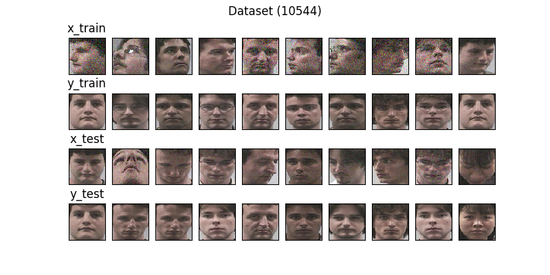

# Model v1
Optimizer - adam (LR - 0.001) <br>
Loss Function - mae <br>
Input Shape - (64, 64, 3) <br>
Filters - (128, 256) <br>
Latent Size - 256 <br>

### Dataset Sample


## Model Summary
```shell script
Model: "Speculo-v1"
_________________________________________________________________
Layer (type)                 Output Shape              Param #   
=================================================================
input (InputLayer)           [(None, 64, 64, 3)]       0         
_________________________________________________________________
conv2d (Conv2D)              (None, 64, 64, 128)       3584      
_________________________________________________________________
max_pooling2d (MaxPooling2D) (None, 32, 32, 128)       0         
_________________________________________________________________
dropout (Dropout)            (None, 32, 32, 128)       0         
_________________________________________________________________
conv2d_1 (Conv2D)            (None, 32, 32, 256)       295168    
_________________________________________________________________
max_pooling2d_1 (MaxPooling2 (None, 16, 16, 256)       0         
_________________________________________________________________
dropout_1 (Dropout)          (None, 16, 16, 256)       0         
_________________________________________________________________
flatten (Flatten)            (None, 65536)             0         
_________________________________________________________________
dropout_2 (Dropout)          (None, 65536)             0         
_________________________________________________________________
latent_space (Dense)         (None, 256)               16777472  
_________________________________________________________________
dense (Dense)                (None, 65536)             16842752  
_________________________________________________________________
reshape (Reshape)            (None, 16, 16, 256)       0         
_________________________________________________________________
conv2d_transpose (Conv2DTran (None, 32, 32, 256)       590080    
_________________________________________________________________
batch_normalization (BatchNo (None, 32, 32, 256)       1024      
_________________________________________________________________
dropout_3 (Dropout)          (None, 32, 32, 256)       0         
_________________________________________________________________
conv2d_transpose_1 (Conv2DTr (None, 64, 64, 128)       295040    
_________________________________________________________________
batch_normalization_1 (Batch (None, 64, 64, 128)       512       
_________________________________________________________________
dropout_4 (Dropout)          (None, 64, 64, 128)       0         
_________________________________________________________________
conv2d_transpose_2 (Conv2DTr (None, 64, 64, 3)         3459      
_________________________________________________________________
output (Activation)          (None, 64, 64, 3)         0         
=================================================================
Total params: 34,809,091
Trainable params: 34,808,323
Non-trainable params: 768
_________________________________________________________________
```


## Training Log
```shell script
Train on 9992 samples, validate on 552 samples
Epoch 1/10
9984/9992 [============================>.] - ETA: 0s - loss: 0.1577 - accuracy: 0.9625
Epoch 00001: loss improved from inf to 0.15767, saving model to models/1/Model-v1.h5
9992/9992 [==============================] - 191s 19ms/sample - loss: 0.1577 - accuracy: 0.9626 - val_loss: 0.1513 - val_accuracy: 0.9840
Epoch 2/10
9984/9992 [============================>.] - ETA: 0s - loss: 0.1516 - accuracy: 0.9812  
Epoch 00002: loss improved from 0.15767 to 0.15160, saving model to models/1/Model-v1.h5
9992/9992 [==============================] - 190s 19ms/sample - loss: 0.1516 - accuracy: 0.9813 - val_loss: 0.1494 - val_accuracy: 0.9849
Epoch 3/10
9984/9992 [============================>.] - ETA: 0s - loss: 0.1477 - accuracy: 0.9822  
Epoch 00003: loss improved from 0.15160 to 0.14772, saving model to models/1/Model-v1.h5
9992/9992 [==============================] - 191s 19ms/sample - loss: 0.1477 - accuracy: 0.9822 - val_loss: 0.1467 - val_accuracy: 0.9850
Epoch 4/10
9984/9992 [============================>.] - ETA: 0s - loss: 0.1436 - accuracy: 0.9830  
Epoch 00004: loss improved from 0.14772 to 0.14355, saving model to models/1/Model-v1.h5
9992/9992 [==============================] - 192s 19ms/sample - loss: 0.1436 - accuracy: 0.9830 - val_loss: 0.1455 - val_accuracy: 0.9852
Epoch 5/10
9984/9992 [============================>.] - ETA: 0s - loss: 0.1383 - accuracy: 0.9833  
Epoch 00005: loss improved from 0.14355 to 0.13830, saving model to models/1/Model-v1.h5
9992/9992 [==============================] - 192s 19ms/sample - loss: 0.1383 - accuracy: 0.9833 - val_loss: 0.1419 - val_accuracy: 0.9848
Epoch 6/10
9984/9992 [============================>.] - ETA: 0s - loss: 0.1345 - accuracy: 0.9835  
Epoch 00006: loss improved from 0.13830 to 0.13447, saving model to models/1/Model-v1.h5
9992/9992 [==============================] - 191s 19ms/sample - loss: 0.1345 - accuracy: 0.9835 - val_loss: 0.1417 - val_accuracy: 0.9830
Epoch 7/10
9984/9992 [============================>.] - ETA: 0s - loss: 0.1323 - accuracy: 0.9837  
Epoch 00007: loss improved from 0.13447 to 0.13226, saving model to models/1/Model-v1.h5
9992/9992 [==============================] - 191s 19ms/sample - loss: 0.1323 - accuracy: 0.9837 - val_loss: 0.1398 - val_accuracy: 0.9828
Epoch 8/10
9984/9992 [============================>.] - ETA: 0s - loss: 0.1303 - accuracy: 0.9845  
Epoch 00008: loss improved from 0.13226 to 0.13032, saving model to models/1/Model-v1.h5
9992/9992 [==============================] - 191s 19ms/sample - loss: 0.1303 - accuracy: 0.9845 - val_loss: 0.1394 - val_accuracy: 0.9825
Epoch 9/10
9984/9992 [============================>.] - ETA: 0s - loss: 0.1293 - accuracy: 0.9850  
Epoch 00009: loss improved from 0.13032 to 0.12925, saving model to models/1/Model-v1.h5
9992/9992 [==============================] - 192s 19ms/sample - loss: 0.1292 - accuracy: 0.9850 - val_loss: 0.1433 - val_accuracy: 0.9776
Epoch 10/10
9984/9992 [============================>.] - ETA: 0s - loss: 0.1295 - accuracy: 0.9850  
Epoch 00010: loss did not improve from 0.12925
9992/9992 [==============================] - 193s 19ms/sample - loss: 0.1295 - accuracy: 0.9850 - val_loss: 0.1506 - val_accuracy: 0.9797
```

### Model accuracy


### Model loss


## Predictions 


## Notes
- Model overfitted because validation loss went up while validation went down
- Should have used a val_loss as the EarlyStopping patience must be lowered
- Need More data
- Try black and white images rather than RGB