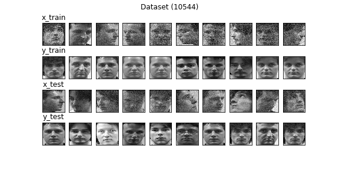
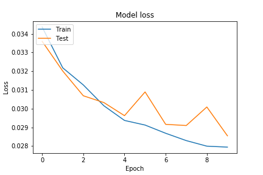

# Model v2
Optimizer - adam (LR - 0.001) <br>
Loss Function - mse <br>
Input Shape - (128, 128, 1) <br>
Filters - (128, 128, 64) <br>
Latent Size - 256 <br>

### Dataset Sample


## Model Summary
```shell script
Model: "Speculo-v2"
_________________________________________________________________
Layer (type)                 Output Shape              Param #   
=================================================================
input (InputLayer)           [(None, 128, 128, 1)]     0         
_________________________________________________________________
conv2d_3 (Conv2D)            (None, 128, 128, 128)     1280      
_________________________________________________________________
max_pooling2d_3 (MaxPooling2 (None, 64, 64, 128)       0         
_________________________________________________________________
dropout_7 (Dropout)          (None, 64, 64, 128)       0         
_________________________________________________________________
conv2d_4 (Conv2D)            (None, 64, 64, 128)       147584    
_________________________________________________________________
max_pooling2d_4 (MaxPooling2 (None, 32, 32, 128)       0         
_________________________________________________________________
dropout_8 (Dropout)          (None, 32, 32, 128)       0         
_________________________________________________________________
conv2d_5 (Conv2D)            (None, 32, 32, 64)        73792     
_________________________________________________________________
max_pooling2d_5 (MaxPooling2 (None, 16, 16, 64)        0         
_________________________________________________________________
dropout_9 (Dropout)          (None, 16, 16, 64)        0         
_________________________________________________________________
flatten_1 (Flatten)          (None, 16384)             0         
_________________________________________________________________
dropout_10 (Dropout)         (None, 16384)             0         
_________________________________________________________________
latent_space (Dense)         (None, 256)               4194560   
_________________________________________________________________
dense_1 (Dense)              (None, 16384)             4210688   
_________________________________________________________________
reshape_1 (Reshape)          (None, 16, 16, 64)        0         
_________________________________________________________________
conv2d_transpose_4 (Conv2DTr (None, 32, 32, 64)        36928     
_________________________________________________________________
batch_normalization_3 (Batch (None, 32, 32, 64)        256       
_________________________________________________________________
dropout_11 (Dropout)         (None, 32, 32, 64)        0         
_________________________________________________________________
conv2d_transpose_5 (Conv2DTr (None, 64, 64, 128)       73856     
_________________________________________________________________
batch_normalization_4 (Batch (None, 64, 64, 128)       512       
_________________________________________________________________
dropout_12 (Dropout)         (None, 64, 64, 128)       0         
_________________________________________________________________
conv2d_transpose_6 (Conv2DTr (None, 128, 128, 128)     147584    
_________________________________________________________________
batch_normalization_5 (Batch (None, 128, 128, 128)     512       
_________________________________________________________________
dropout_13 (Dropout)         (None, 128, 128, 128)     0         
_________________________________________________________________
conv2d_transpose_7 (Conv2DTr (None, 128, 128, 1)       1153      
_________________________________________________________________
output (Activation)          (None, 128, 128, 1)       0         
=================================================================
Total params: 8,888,705
Trainable params: 8,888,065
Non-trainable params: 640
_________________________________________________________________
```


## Training Log
```shell script
Train on 9992 samples, validate on 552 samples
Epoch 1/10
9984/9992 [============================>.] - ETA: 0s - loss: 0.0344
Epoch 00001: loss improved from inf to 0.03436, saving model to models/1/Model-v1.h5
9992/9992 [==============================] - 162s 16ms/sample - loss: 0.0344 - val_loss: 0.0336
Epoch 2/10
9984/9992 [============================>.] - ETA: 0s - loss: 0.0322
Epoch 00002: loss improved from 0.03436 to 0.03218, saving model to models/1/Model-v1.h5
9992/9992 [==============================] - 153s 15ms/sample - loss: 0.0322 - val_loss: 0.0320
Epoch 3/10
9984/9992 [============================>.] - ETA: 0s - loss: 0.0313
Epoch 00003: loss improved from 0.03218 to 0.03127, saving model to models/1/Model-v1.h5
9992/9992 [==============================] - 153s 15ms/sample - loss: 0.0313 - val_loss: 0.0307
Epoch 4/10
9984/9992 [============================>.] - ETA: 0s - loss: 0.0302
Epoch 00004: loss improved from 0.03127 to 0.03016, saving model to models/1/Model-v1.h5
9992/9992 [==============================] - 153s 15ms/sample - loss: 0.0302 - val_loss: 0.0303
Epoch 5/10
9984/9992 [============================>.] - ETA: 0s - loss: 0.0294
Epoch 00005: loss improved from 0.03016 to 0.02937, saving model to models/1/Model-v1.h5
9992/9992 [==============================] - 153s 15ms/sample - loss: 0.0294 - val_loss: 0.0296
Epoch 6/10
9984/9992 [============================>.] - ETA: 0s - loss: 0.0291
Epoch 00006: loss improved from 0.02937 to 0.02913, saving model to models/1/Model-v1.h5
9992/9992 [==============================] - 153s 15ms/sample - loss: 0.0291 - val_loss: 0.0309
Epoch 7/10
9984/9992 [============================>.] - ETA: 0s - loss: 0.0287
Epoch 00007: loss improved from 0.02913 to 0.02869, saving model to models/1/Model-v1.h5
9992/9992 [==============================] - 153s 15ms/sample - loss: 0.0287 - val_loss: 0.0292
Epoch 8/10
9984/9992 [============================>.] - ETA: 0s - loss: 0.0283
Epoch 00008: loss improved from 0.02869 to 0.02830, saving model to models/1/Model-v1.h5
9992/9992 [==============================] - 153s 15ms/sample - loss: 0.0283 - val_loss: 0.0291
Epoch 9/10
9984/9992 [============================>.] - ETA: 0s - loss: 0.0280
Epoch 00009: loss improved from 0.02830 to 0.02800, saving model to models/1/Model-v1.h5
9992/9992 [==============================] - 152s 15ms/sample - loss: 0.0280 - val_loss: 0.0301
Epoch 10/10
9984/9992 [============================>.] - ETA: 0s - loss: 0.0279
Epoch 00010: loss improved from 0.02800 to 0.02795, saving model to models/1/Model-v1.h5
9992/9992 [==============================] - 153s 15ms/sample - loss: 0.0279 - val_loss: 0.0286
```

### Model loss


## Predictions 


## Notes
- Drop the accuracy metrics because as this is generative model accuracy don't give valid outputs
- Increased the size of the dataset by creating new faces by adding noise to existing faces
- Added some visualizations
- Changed model to use grayscale images
    - we really don't need colours to identify a faces
    - so we can just ignore RGB and make it easy on the model
    - that reduced the model size by half
- Increased input size so model get a more clear understanding of the face
- changed the filter sizes so there are more parameters to tune