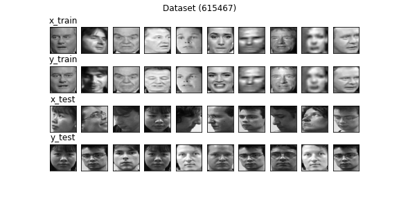
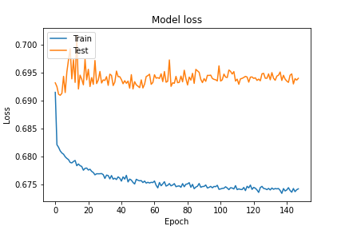
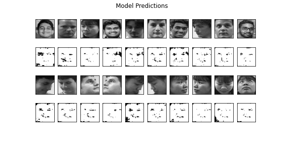

# Model v10
Optimizer - adam (LR - 0.001) <br>
Loss Function - binary_crossentropy <br>
Input Shape - (128, 128, 1) <br>
Output Shape - (64, 64, 1) <br>
Encoding Filters - (512, 512, 256, 128, 64) <br>
Decoding Filters - (64, 128, 256, 512) <br>
Latent Size - 2048 <br>

### Dataset Sample


## Model Summary
```shell script
Model: "Speculo-v10"
_________________________________________________________________
Layer (type)                 Output Shape              Param #   
=================================================================
input (InputLayer)           [(None, 128, 128, 1)]     0         
_________________________________________________________________
conv2d_5 (Conv2D)            (None, 128, 128, 512)     5120      
_________________________________________________________________
max_pooling2d_5 (MaxPooling2 (None, 64, 64, 512)       0         
_________________________________________________________________
conv2d_6 (Conv2D)            (None, 64, 64, 512)       2359808   
_________________________________________________________________
max_pooling2d_6 (MaxPooling2 (None, 32, 32, 512)       0         
_________________________________________________________________
dropout_4 (Dropout)          (None, 32, 32, 512)       0         
_________________________________________________________________
conv2d_7 (Conv2D)            (None, 32, 32, 256)       1179904   
_________________________________________________________________
max_pooling2d_7 (MaxPooling2 (None, 16, 16, 256)       0         
_________________________________________________________________
conv2d_8 (Conv2D)            (None, 16, 16, 128)       295040    
_________________________________________________________________
max_pooling2d_8 (MaxPooling2 (None, 8, 8, 128)         0         
_________________________________________________________________
dropout_5 (Dropout)          (None, 8, 8, 128)         0         
_________________________________________________________________
conv2d_9 (Conv2D)            (None, 8, 8, 64)          73792     
_________________________________________________________________
max_pooling2d_9 (MaxPooling2 (None, 4, 4, 64)          0         
_________________________________________________________________
flatten_1 (Flatten)          (None, 1024)              0         
_________________________________________________________________
latent_space (Dense)         (None, 2048)              2099200   
_________________________________________________________________
dense_1 (Dense)              (None, 1024)              2098176   
_________________________________________________________________
reshape_1 (Reshape)          (None, 4, 4, 64)          0         
_________________________________________________________________
conv2d_transpose_5 (Conv2DTr (None, 8, 8, 64)          36928     
_________________________________________________________________
batch_normalization_4 (Batch (None, 8, 8, 64)          256       
_________________________________________________________________
dropout_6 (Dropout)          (None, 8, 8, 64)          0         
_________________________________________________________________
conv2d_transpose_6 (Conv2DTr (None, 16, 16, 128)       73856     
_________________________________________________________________
batch_normalization_5 (Batch (None, 16, 16, 128)       512       
_________________________________________________________________
conv2d_transpose_7 (Conv2DTr (None, 32, 32, 256)       295168    
_________________________________________________________________
batch_normalization_6 (Batch (None, 32, 32, 256)       1024      
_________________________________________________________________
dropout_7 (Dropout)          (None, 32, 32, 256)       0         
_________________________________________________________________
conv2d_transpose_8 (Conv2DTr (None, 64, 64, 512)       1180160   
_________________________________________________________________
batch_normalization_7 (Batch (None, 64, 64, 512)       2048      
_________________________________________________________________
conv2d_transpose_9 (Conv2DTr (None, 64, 64, 1)         4609      
_________________________________________________________________
output (Activation)          (None, 64, 64, 1)         0         
=================================================================
Total params: 9,705,601
Trainable params: 9,703,681
Non-trainable params: 1,920
_________________________________________________________________
```


## Training Log
```shell script

```

### Model loss


## Predictions 


## Notes
- Increased number of hidden layers
- Increased Latent Space Size
- Tried binary_crossentropy again becouse most of the people had luck with binary_crossentropy than Mean squared error
- Model loss improvements is good but the validation loss didn't improve a lot