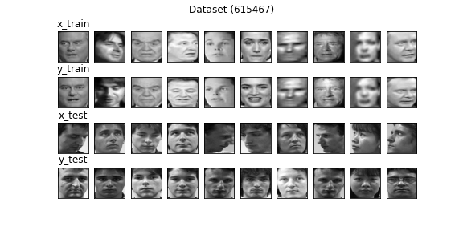
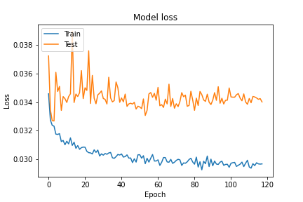
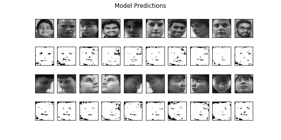

# Model v13
Optimizer - adam (LR - 0.001) <br>
Loss Function - mse <br>
Input Shape - (128, 128, 1) <br>
Output Shape - (64, 64, 1) <br>
Encoding Filters - (256, 128, 64) <br>
Decoding Filters - (64, 128) <br>
Latent Size - 64 <br>

### Dataset Sample


## Model Summary
```shell script
Model: "Speculo-v13"
_________________________________________________________________
Layer (type)                 Output Shape              Param #   
=================================================================
input (InputLayer)           [(None, 128, 128, 1)]     0         
_________________________________________________________________
conv2d_3 (Conv2D)            (None, 128, 128, 256)     2560      
_________________________________________________________________
max_pooling2d_3 (MaxPooling2 (None, 64, 64, 256)       0         
_________________________________________________________________
conv2d_4 (Conv2D)            (None, 64, 64, 128)       295040    
_________________________________________________________________
max_pooling2d_4 (MaxPooling2 (None, 32, 32, 128)       0         
_________________________________________________________________
dropout_2 (Dropout)          (None, 32, 32, 128)       0         
_________________________________________________________________
conv2d_5 (Conv2D)            (None, 32, 32, 64)        73792     
_________________________________________________________________
max_pooling2d_5 (MaxPooling2 (None, 16, 16, 64)        0         
_________________________________________________________________
flatten_1 (Flatten)          (None, 16384)             0         
_________________________________________________________________
dense_5 (Dense)              (None, 256)               4194560   
_________________________________________________________________
dense_6 (Dense)              (None, 128)               32896     
_________________________________________________________________
latent_space (Dense)         (None, 64)                8256      
_________________________________________________________________
dense_7 (Dense)              (None, 128)               8320      
_________________________________________________________________
dense_8 (Dense)              (None, 256)               33024     
_________________________________________________________________
dense_9 (Dense)              (None, 16384)             4210688   
_________________________________________________________________
reshape_1 (Reshape)          (None, 16, 16, 64)        0         
_________________________________________________________________
conv2d_transpose_3 (Conv2DTr (None, 32, 32, 64)        36928     
_________________________________________________________________
batch_normalization_2 (Batch (None, 32, 32, 64)        256       
_________________________________________________________________
dropout_3 (Dropout)          (None, 32, 32, 64)        0         
_________________________________________________________________
conv2d_transpose_4 (Conv2DTr (None, 64, 64, 128)       73856     
_________________________________________________________________
batch_normalization_3 (Batch (None, 64, 64, 128)       512       
_________________________________________________________________
conv2d_transpose_5 (Conv2DTr (None, 64, 64, 1)         1153      
_________________________________________________________________
output (Activation)          (None, 64, 64, 1)         0         
=================================================================
Total params: 8,971,841
Trainable params: 8,971,457
Non-trainable params: 384
_________________________________________________________________
```


## Training Log
```shell script

```

### Model loss


## Predictions 


## Notes
