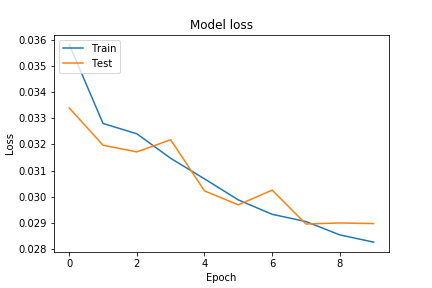

# Model v3
Optimizer - adam (LR - 0.001) <br>
Loss Function - mse <br>
Input Shape - (128, 128, 1) <br>
Filters - (256, 128, 64) <br>
Latent Size - 350 <br>

### Dataset Sample


## Model Summary
```shell script
Model: "Speculo-v3"
_________________________________________________________________
Layer (type)                 Output Shape              Param #   
=================================================================
input (InputLayer)           [(None, 128, 128, 1)]     0         
_________________________________________________________________
conv2d_21 (Conv2D)           (None, 128, 128, 256)     2560      
_________________________________________________________________
max_pooling2d_21 (MaxPooling (None, 64, 64, 256)       0         
_________________________________________________________________
dropout_49 (Dropout)         (None, 64, 64, 256)       0         
_________________________________________________________________
conv2d_22 (Conv2D)           (None, 64, 64, 128)       295040    
_________________________________________________________________
max_pooling2d_22 (MaxPooling (None, 32, 32, 128)       0         
_________________________________________________________________
dropout_50 (Dropout)         (None, 32, 32, 128)       0         
_________________________________________________________________
conv2d_23 (Conv2D)           (None, 32, 32, 64)        73792     
_________________________________________________________________
max_pooling2d_23 (MaxPooling (None, 16, 16, 64)        0         
_________________________________________________________________
dropout_51 (Dropout)         (None, 16, 16, 64)        0         
_________________________________________________________________
flatten_7 (Flatten)          (None, 16384)             0         
_________________________________________________________________
dropout_52 (Dropout)         (None, 16384)             0         
_________________________________________________________________
latent_space (Dense)         (None, 350)               5734750   
_________________________________________________________________
dense_7 (Dense)              (None, 16384)             5750784   
_________________________________________________________________
reshape_7 (Reshape)          (None, 16, 16, 64)        0         
_________________________________________________________________
conv2d_transpose_28 (Conv2DT (None, 32, 32, 64)        36928     
_________________________________________________________________
batch_normalization_21 (Batc (None, 32, 32, 64)        256       
_________________________________________________________________
dropout_53 (Dropout)         (None, 32, 32, 64)        0         
_________________________________________________________________
conv2d_transpose_29 (Conv2DT (None, 64, 64, 128)       73856     
_________________________________________________________________
batch_normalization_22 (Batc (None, 64, 64, 128)       512       
_________________________________________________________________
dropout_54 (Dropout)         (None, 64, 64, 128)       0         
_________________________________________________________________
conv2d_transpose_30 (Conv2DT (None, 128, 128, 256)     295168    
_________________________________________________________________
batch_normalization_23 (Batc (None, 128, 128, 256)     1024      
_________________________________________________________________
dropout_55 (Dropout)         (None, 128, 128, 256)     0         
_________________________________________________________________
conv2d_transpose_31 (Conv2DT (None, 128, 128, 1)       2305      
_________________________________________________________________
output (Activation)          (None, 128, 128, 1)       0         
=================================================================
Total params: 12,266,975
Trainable params: 12,266,079
Non-trainable params: 896
_________________________________________________________________
```


## Training Log
```shell script
Train on 9992 samples, validate on 552 samples
Epoch 1/50
9984/9992 [============================>.] - ETA: 0s - loss: 0.0358
Epoch 00001: loss improved from inf to 0.03583, saving model to models/3/Model-v3.h5
9992/9992 [==============================] - 258s 26ms/sample - loss: 0.0358 - val_loss: 0.0334
Epoch 2/50
9984/9992 [============================>.] - ETA: 0s - loss: 0.0328
Epoch 00002: loss improved from 0.03583 to 0.03280, saving model to models/3/Model-v3.h5
9992/9992 [==============================] - 250s 25ms/sample - loss: 0.0328 - val_loss: 0.0320
Epoch 3/50
9984/9992 [============================>.] - ETA: 0s - loss: 0.0324
Epoch 00003: loss improved from 0.03280 to 0.03241, saving model to models/3/Model-v3.h5
9992/9992 [==============================] - 250s 25ms/sample - loss: 0.0324 - val_loss: 0.0317
Epoch 4/50
9984/9992 [============================>.] - ETA: 0s - loss: 0.0315
Epoch 00004: loss improved from 0.03241 to 0.03147, saving model to models/3/Model-v3.h5
9992/9992 [==============================] - 250s 25ms/sample - loss: 0.0315 - val_loss: 0.0322
Epoch 5/50
9984/9992 [============================>.] - ETA: 0s - loss: 0.0307
Epoch 00005: loss improved from 0.03147 to 0.03068, saving model to models/3/Model-v3.h5
9992/9992 [==============================] - 250s 25ms/sample - loss: 0.0307 - val_loss: 0.0302
Epoch 6/50
9984/9992 [============================>.] - ETA: 0s - loss: 0.0299
Epoch 00006: loss improved from 0.03068 to 0.02987, saving model to models/3/Model-v3.h5
9992/9992 [==============================] - 249s 25ms/sample - loss: 0.0299 - val_loss: 0.0297
Epoch 7/50
9984/9992 [============================>.] - ETA: 0s - loss: 0.0293
Epoch 00007: loss improved from 0.02987 to 0.02932, saving model to models/3/Model-v3.h5
9992/9992 [==============================] - 249s 25ms/sample - loss: 0.0293 - val_loss: 0.0302
Epoch 8/50
9984/9992 [============================>.] - ETA: 0s - loss: 0.0290
Epoch 00008: loss improved from 0.02932 to 0.02904, saving model to models/3/Model-v3.h5
9992/9992 [==============================] - 249s 25ms/sample - loss: 0.0290 - val_loss: 0.0289
Epoch 9/50
9984/9992 [============================>.] - ETA: 0s - loss: 0.0285
Epoch 00009: loss improved from 0.02904 to 0.02853, saving model to models/3/Model-v3.h5
9992/9992 [==============================] - 249s 25ms/sample - loss: 0.0285 - val_loss: 0.0290
Epoch 10/50
9984/9992 [============================>.] - ETA: 0s - loss: 0.0283
Epoch 00010: loss improved from 0.02853 to 0.02826, saving model to models/3/Model-v3.h5
9992/9992 [==============================] - 249s 25ms/sample - loss: 0.0283 - val_loss: 0.0290
Epoch 00010: early stopping
```

### Model loss


## Predictions 


## Notes
- Increased filter sizes so there are more parameters to tune
- Increased batch sizes so model can tune of large set of images at once 