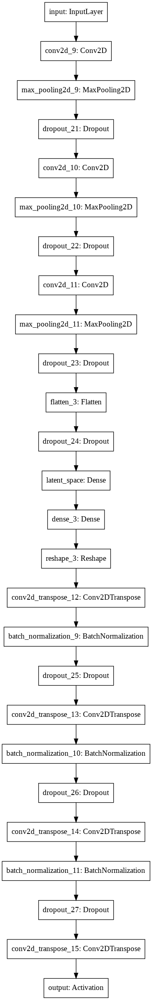
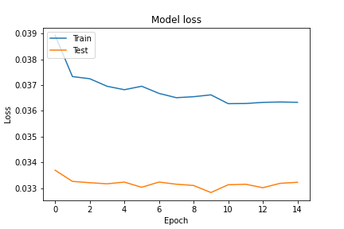

# Model v4
Optimizer - adam (LR - 0.001) <br>
Loss Function - mse <br>
Input Shape - (64, 64, 1) <br>
Filters - (128, 64, 32) <br>
Latent Size - 256 <br>

### Dataset Sample


## Model Summary
```shell script
Model: "Speculo-v4"
_________________________________________________________________
Layer (type)                 Output Shape              Param #   
=================================================================
input (InputLayer)           [(None, 64, 64, 1)]       0         
_________________________________________________________________
conv2d_9 (Conv2D)            (None, 64, 64, 128)       1280      
_________________________________________________________________
max_pooling2d_9 (MaxPooling2 (None, 32, 32, 128)       0         
_________________________________________________________________
dropout_21 (Dropout)         (None, 32, 32, 128)       0         
_________________________________________________________________
conv2d_10 (Conv2D)           (None, 32, 32, 64)        73792     
_________________________________________________________________
max_pooling2d_10 (MaxPooling (None, 16, 16, 64)        0         
_________________________________________________________________
dropout_22 (Dropout)         (None, 16, 16, 64)        0         
_________________________________________________________________
conv2d_11 (Conv2D)           (None, 16, 16, 32)        18464     
_________________________________________________________________
max_pooling2d_11 (MaxPooling (None, 8, 8, 32)          0         
_________________________________________________________________
dropout_23 (Dropout)         (None, 8, 8, 32)          0         
_________________________________________________________________
flatten_3 (Flatten)          (None, 2048)              0         
_________________________________________________________________
dropout_24 (Dropout)         (None, 2048)              0         
_________________________________________________________________
latent_space (Dense)         (None, 256)               524544    
_________________________________________________________________
dense_3 (Dense)              (None, 2048)              526336    
_________________________________________________________________
reshape_3 (Reshape)          (None, 8, 8, 32)          0         
_________________________________________________________________
conv2d_transpose_12 (Conv2DT (None, 16, 16, 32)        9248      
_________________________________________________________________
batch_normalization_9 (Batch (None, 16, 16, 32)        128       
_________________________________________________________________
dropout_25 (Dropout)         (None, 16, 16, 32)        0         
_________________________________________________________________
conv2d_transpose_13 (Conv2DT (None, 32, 32, 64)        18496     
_________________________________________________________________
batch_normalization_10 (Batc (None, 32, 32, 64)        256       
_________________________________________________________________
dropout_26 (Dropout)         (None, 32, 32, 64)        0         
_________________________________________________________________
conv2d_transpose_14 (Conv2DT (None, 64, 64, 128)       73856     
_________________________________________________________________
batch_normalization_11 (Batc (None, 64, 64, 128)       512       
_________________________________________________________________
dropout_27 (Dropout)         (None, 64, 64, 128)       0         
_________________________________________________________________
conv2d_transpose_15 (Conv2DT (None, 64, 64, 1)         1153      
_________________________________________________________________
output (Activation)          (None, 64, 64, 1)         0         
=================================================================
Total params: 1,248,065
Trainable params: 1,247,617
Non-trainable params: 448
_________________________________________________________________
```


## Training Log
```shell script
Epoch 1/6844
256/256 [==============================] - ETA: 0s - loss: 0.0389WARNING:tensorflow:Your input ran out of data; interrupting training. Make sure that your dataset or generator can generate at least `steps_per_epoch * epochs` batches (in this case, 64 batches). You may need to use the repeat() function when building your dataset.

Epoch 00001: loss improved from inf to 0.03893, saving model to models/4/Model-v4.h5

256/256 [==============================] - 317s 1s/step - loss: 0.0389 - val_loss: 0.0337
Epoch 2/6844
256/256 [==============================] - ETA: 0s - loss: 0.0373WARNING:tensorflow:Your input ran out of data; interrupting training. Make sure that your dataset or generator can generate at least `steps_per_epoch * epochs` batches (in this case, 64 batches). You may need to use the repeat() function when building your dataset.

Epoch 00002: loss improved from 0.03893 to 0.03733, saving model to models/4/Model-v4.h5

256/256 [==============================] - 317s 1s/step - loss: 0.0373 - val_loss: 0.0333
Epoch 3/6844
256/256 [==============================] - ETA: 0s - loss: 0.0372WARNING:tensorflow:Your input ran out of data; interrupting training. Make sure that your dataset or generator can generate at least `steps_per_epoch * epochs` batches (in this case, 64 batches). You may need to use the repeat() function when building your dataset.

Epoch 00003: loss improved from 0.03733 to 0.03725, saving model to models/4/Model-v4.h5

256/256 [==============================] - 318s 1s/step - loss: 0.0372 - val_loss: 0.0332
Epoch 4/6844
256/256 [==============================] - ETA: 0s - loss: 0.0370WARNING:tensorflow:Your input ran out of data; interrupting training. Make sure that your dataset or generator can generate at least `steps_per_epoch * epochs` batches (in this case, 64 batches). You may need to use the repeat() function when building your dataset.

Epoch 00004: loss improved from 0.03725 to 0.03696, saving model to models/4/Model-v4.h5

256/256 [==============================] - 318s 1s/step - loss: 0.0370 - val_loss: 0.0332
Epoch 5/6844
256/256 [==============================] - ETA: 0s - loss: 0.0368WARNING:tensorflow:Your input ran out of data; interrupting training. Make sure that your dataset or generator can generate at least `steps_per_epoch * epochs` batches (in this case, 64 batches). You may need to use the repeat() function when building your dataset.

Epoch 00005: loss improved from 0.03696 to 0.03682, saving model to models/4/Model-v4.h5

256/256 [==============================] - 317s 1s/step - loss: 0.0368 - val_loss: 0.0332
Epoch 6/6844
256/256 [==============================] - ETA: 0s - loss: 0.0370WARNING:tensorflow:Your input ran out of data; interrupting training. Make sure that your dataset or generator can generate at least `steps_per_epoch * epochs` batches (in this case, 64 batches). You may need to use the repeat() function when building your dataset.

Epoch 00006: loss did not improve from 0.03682

256/256 [==============================] - 318s 1s/step - loss: 0.0370 - val_loss: 0.0330
Epoch 7/6844
256/256 [==============================] - ETA: 0s - loss: 0.0367WARNING:tensorflow:Your input ran out of data; interrupting training. Make sure that your dataset or generator can generate at least `steps_per_epoch * epochs` batches (in this case, 64 batches). You may need to use the repeat() function when building your dataset.

Epoch 00007: loss improved from 0.03682 to 0.03668, saving model to models/4/Model-v4.h5

256/256 [==============================] - 317s 1s/step - loss: 0.0367 - val_loss: 0.0332
Epoch 8/6844
256/256 [==============================] - ETA: 0s - loss: 0.0365WARNING:tensorflow:Your input ran out of data; interrupting training. Make sure that your dataset or generator can generate at least `steps_per_epoch * epochs` batches (in this case, 64 batches). You may need to use the repeat() function when building your dataset.

Epoch 00008: loss improved from 0.03668 to 0.03651, saving model to models/4/Model-v4.h5

256/256 [==============================] - 317s 1s/step - loss: 0.0365 - val_loss: 0.0332
Epoch 9/6844
256/256 [==============================] - ETA: 0s - loss: 0.0365WARNING:tensorflow:Your input ran out of data; interrupting training. Make sure that your dataset or generator can generate at least `steps_per_epoch * epochs` batches (in this case, 64 batches). You may need to use the repeat() function when building your dataset.

Epoch 00009: loss did not improve from 0.03651

256/256 [==============================] - 316s 1s/step - loss: 0.0365 - val_loss: 0.0331
Epoch 10/6844
256/256 [==============================] - ETA: 0s - loss: 0.0366WARNING:tensorflow:Your input ran out of data; interrupting training. Make sure that your dataset or generator can generate at least `steps_per_epoch * epochs` batches (in this case, 64 batches). You may need to use the repeat() function when building your dataset.

Epoch 00010: loss did not improve from 0.03651

256/256 [==============================] - 316s 1s/step - loss: 0.0366 - val_loss: 0.0328
Epoch 11/6844
256/256 [==============================] - ETA: 0s - loss: 0.0363WARNING:tensorflow:Your input ran out of data; interrupting training. Make sure that your dataset or generator can generate at least `steps_per_epoch * epochs` batches (in this case, 64 batches). You may need to use the repeat() function when building your dataset.

Epoch 00011: loss improved from 0.03651 to 0.03628, saving model to models/4/Model-v4.h5

256/256 [==============================] - 317s 1s/step - loss: 0.0363 - val_loss: 0.0331
Epoch 12/6844
256/256 [==============================] - ETA: 0s - loss: 0.0363WARNING:tensorflow:Your input ran out of data; interrupting training. Make sure that your dataset or generator can generate at least `steps_per_epoch * epochs` batches (in this case, 64 batches). You may need to use the repeat() function when building your dataset.

Epoch 00012: loss did not improve from 0.03628

256/256 [==============================] - 316s 1s/step - loss: 0.0363 - val_loss: 0.0332
Epoch 13/6844
256/256 [==============================] - ETA: 0s - loss: 0.0363WARNING:tensorflow:Your input ran out of data; interrupting training. Make sure that your dataset or generator can generate at least `steps_per_epoch * epochs` batches (in this case, 64 batches). You may need to use the repeat() function when building your dataset.

Epoch 00013: loss did not improve from 0.03628

256/256 [==============================] - 317s 1s/step - loss: 0.0363 - val_loss: 0.0330
Epoch 14/6844
256/256 [==============================] - ETA: 0s - loss: 0.0363WARNING:tensorflow:Your input ran out of data; interrupting training. Make sure that your dataset or generator can generate at least `steps_per_epoch * epochs` batches (in this case, 64 batches). You may need to use the repeat() function when building your dataset.

Epoch 00014: loss did not improve from 0.03628

256/256 [==============================] - 316s 1s/step - loss: 0.0363 - val_loss: 0.0332
Epoch 15/6844
256/256 [==============================] - ETA: 0s - loss: 0.0363WARNING:tensorflow:Your input ran out of data; interrupting training. Make sure that your dataset or generator can generate at least `steps_per_epoch * epochs` batches (in this case, 64 batches). You may need to use the repeat() function when building your dataset.

Epoch 00015: loss did not improve from 0.03628

256/256 [==============================] - 316s 1s/step - loss: 0.0363 - val_loss: 0.0332
Epoch 00015: early stopping
```

### Model loss


## Predictions 


## Notes
- Downloaded new dataset
- Preprocessed all 621,126 Images (Which took 22 hours on 24 core Machine on GCP)
    - Extract Faces
    - Find the most front facing image
    - Separated features and targets
- Rewrote the data ingestion pipeline
    - as this dataset it huge we can't load the entire data set to the memory so I used tensorflow's ingestion pipeline to read that dataset in batches
    - all the loaded images need to be preprocessed again before sending it to the model. So I updated the pipeline to preprocessed in the CPU while GPU is training the model and GPU don't have wait for CPU to send data

|                                                   |                                                                                  |
| :-----------------------------------------------: |:--------------------------------------------------------------------------------:|
|||
| **Before**                                 | **After**                                               |

- Did some code refactoring
- Wrote a custom callback function to generate visualization of model's current progress