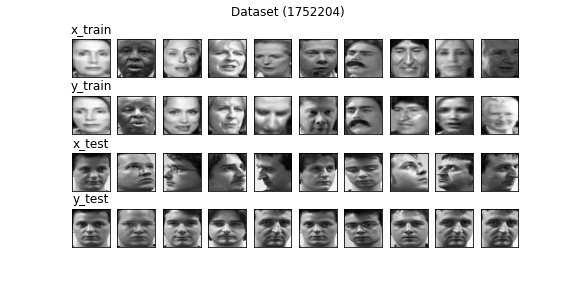
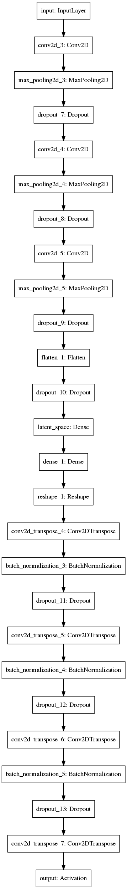
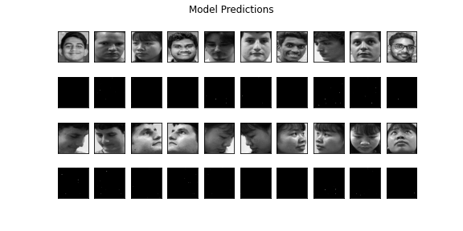

# Model v5
Optimizer - adam (LR - 0.001) <br>
Loss Function - mse <br>
Input Shape - (64, 64, 1) <br>
Filters - (128, 64, 32) <br>
Latent Size - 256 <br>

### Dataset Sample


## Model Summary
```shell script
Model: "Speculo-v5"
_________________________________________________________________
Layer (type)                 Output Shape              Param #   
=================================================================
input (InputLayer)           [(None, 64, 64, 1)]       0         
_________________________________________________________________
conv2d_3 (Conv2D)            (None, 64, 64, 128)       1280      
_________________________________________________________________
max_pooling2d_3 (MaxPooling2 (None, 32, 32, 128)       0         
_________________________________________________________________
dropout_7 (Dropout)          (None, 32, 32, 128)       0         
_________________________________________________________________
conv2d_4 (Conv2D)            (None, 32, 32, 64)        73792     
_________________________________________________________________
max_pooling2d_4 (MaxPooling2 (None, 16, 16, 64)        0         
_________________________________________________________________
dropout_8 (Dropout)          (None, 16, 16, 64)        0         
_________________________________________________________________
conv2d_5 (Conv2D)            (None, 16, 16, 32)        18464     
_________________________________________________________________
max_pooling2d_5 (MaxPooling2 (None, 8, 8, 32)          0         
_________________________________________________________________
dropout_9 (Dropout)          (None, 8, 8, 32)          0         
_________________________________________________________________
flatten_1 (Flatten)          (None, 2048)              0         
_________________________________________________________________
dropout_10 (Dropout)         (None, 2048)              0         
_________________________________________________________________
latent_space (Dense)         (None, 256)               524544    
_________________________________________________________________
dense_1 (Dense)              (None, 2048)              526336    
_________________________________________________________________
reshape_1 (Reshape)          (None, 8, 8, 32)          0         
_________________________________________________________________
conv2d_transpose_4 (Conv2DTr (None, 16, 16, 32)        9248      
_________________________________________________________________
batch_normalization_3 (Batch (None, 16, 16, 32)        128       
_________________________________________________________________
dropout_11 (Dropout)         (None, 16, 16, 32)        0         
_________________________________________________________________
conv2d_transpose_5 (Conv2DTr (None, 32, 32, 64)        18496     
_________________________________________________________________
batch_normalization_4 (Batch (None, 32, 32, 64)        256       
_________________________________________________________________
dropout_12 (Dropout)         (None, 32, 32, 64)        0         
_________________________________________________________________
conv2d_transpose_6 (Conv2DTr (None, 64, 64, 128)       73856     
_________________________________________________________________
batch_normalization_5 (Batch (None, 64, 64, 128)       512       
_________________________________________________________________
dropout_13 (Dropout)         (None, 64, 64, 128)       0         
_________________________________________________________________
conv2d_transpose_7 (Conv2DTr (None, 64, 64, 1)         1153      
_________________________________________________________________
output (Activation)          (None, 64, 64, 1)         0         
=================================================================
Total params: 1,248,065
Trainable params: 1,247,617
Non-trainable params: 448
_________________________________________________________________
```


## Training Log
```shell script

```

## Predictions 


## Notes
- Trained the model on GCP with Nvidia k80
- Model couldn't convergence and loss got stuck around 0.35
    - Check Tensorboard logs for more info
    - Mostly likely gradient descent algorithm found a local minimum and LR rate was too small to get over it
    - Resetting the graph fixed the issue