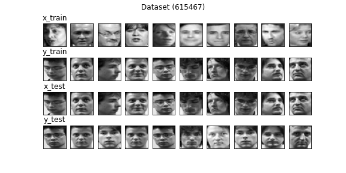
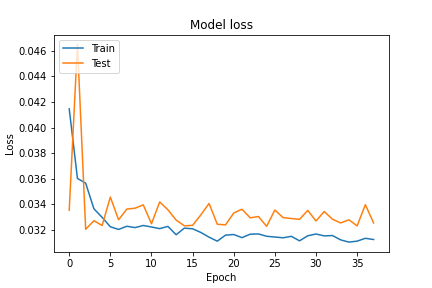
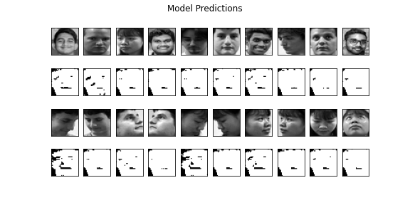

# Model v8
Optimizer - adam (LR - 0.001) <br>
Loss Function - mse <br>
Input Shape - (32, 32, 1) <br>
Filters - (1024, 512, 256, 128, 64) <br>
Latent Size - 4096 <br>

### Dataset Sample


## Model Summary
```shell script
Model: "Speculo-v8"
_________________________________________________________________
Layer (type)                 Output Shape              Param #   
=================================================================
input (InputLayer)           [(None, 32, 32, 1)]       0         
_________________________________________________________________
conv2d_5 (Conv2D)            (None, 32, 32, 1024)      10240     
_________________________________________________________________
max_pooling2d_5 (MaxPooling2 (None, 16, 16, 1024)      0         
_________________________________________________________________
dropout_11 (Dropout)         (None, 16, 16, 1024)      0         
_________________________________________________________________
conv2d_6 (Conv2D)            (None, 16, 16, 512)       4719104   
_________________________________________________________________
max_pooling2d_6 (MaxPooling2 (None, 8, 8, 512)         0         
_________________________________________________________________
dropout_12 (Dropout)         (None, 8, 8, 512)         0         
_________________________________________________________________
conv2d_7 (Conv2D)            (None, 8, 8, 256)         1179904   
_________________________________________________________________
max_pooling2d_7 (MaxPooling2 (None, 4, 4, 256)         0         
_________________________________________________________________
dropout_13 (Dropout)         (None, 4, 4, 256)         0         
_________________________________________________________________
conv2d_8 (Conv2D)            (None, 4, 4, 128)         295040    
_________________________________________________________________
max_pooling2d_8 (MaxPooling2 (None, 2, 2, 128)         0         
_________________________________________________________________
dropout_14 (Dropout)         (None, 2, 2, 128)         0         
_________________________________________________________________
conv2d_9 (Conv2D)            (None, 2, 2, 64)          73792     
_________________________________________________________________
max_pooling2d_9 (MaxPooling2 (None, 1, 1, 64)          0         
_________________________________________________________________
dropout_15 (Dropout)         (None, 1, 1, 64)          0         
_________________________________________________________________
flatten_1 (Flatten)          (None, 64)                0         
_________________________________________________________________
dropout_16 (Dropout)         (None, 64)                0         
_________________________________________________________________
latent_space (Dense)         (None, 4096)              266240    
_________________________________________________________________
dense_1 (Dense)              (None, 64)                262208    
_________________________________________________________________
reshape_1 (Reshape)          (None, 1, 1, 64)          0         
_________________________________________________________________
conv2d_transpose_6 (Conv2DTr (None, 2, 2, 64)          36928     
_________________________________________________________________
batch_normalization_5 (Batch (None, 2, 2, 64)          256       
_________________________________________________________________
dropout_17 (Dropout)         (None, 2, 2, 64)          0         
_________________________________________________________________
conv2d_transpose_7 (Conv2DTr (None, 4, 4, 128)         73856     
_________________________________________________________________
batch_normalization_6 (Batch (None, 4, 4, 128)         512       
_________________________________________________________________
dropout_18 (Dropout)         (None, 4, 4, 128)         0         
_________________________________________________________________
conv2d_transpose_8 (Conv2DTr (None, 8, 8, 256)         295168    
_________________________________________________________________
batch_normalization_7 (Batch (None, 8, 8, 256)         1024      
_________________________________________________________________
dropout_19 (Dropout)         (None, 8, 8, 256)         0         
_________________________________________________________________
conv2d_transpose_9 (Conv2DTr (None, 16, 16, 512)       1180160   
_________________________________________________________________
batch_normalization_8 (Batch (None, 16, 16, 512)       2048      
_________________________________________________________________
dropout_20 (Dropout)         (None, 16, 16, 512)       0         
_________________________________________________________________
conv2d_transpose_10 (Conv2DT (None, 32, 32, 1024)      4719616   
_________________________________________________________________
batch_normalization_9 (Batch (None, 32, 32, 1024)      4096      
_________________________________________________________________
dropout_21 (Dropout)         (None, 32, 32, 1024)      0         
_________________________________________________________________
conv2d_transpose_11 (Conv2DT (None, 32, 32, 1)         9217      
_________________________________________________________________
output (Activation)          (None, 32, 32, 1)         0         
=================================================================
Total params: 13,129,409
Trainable params: 13,125,441
Non-trainable params: 3,968
_________________________________________________________________
```


## Training Log
```shell script

```

### Model loss


## Predictions 


## Notes
- binary cross entropy didn't gave improvement so I reverted back to mean squared error
- lowered fingerprint size so it has less values to predict
- although this model has the lowest low I don't think this is the better than model v7 due to fact it produced less face looking outputs